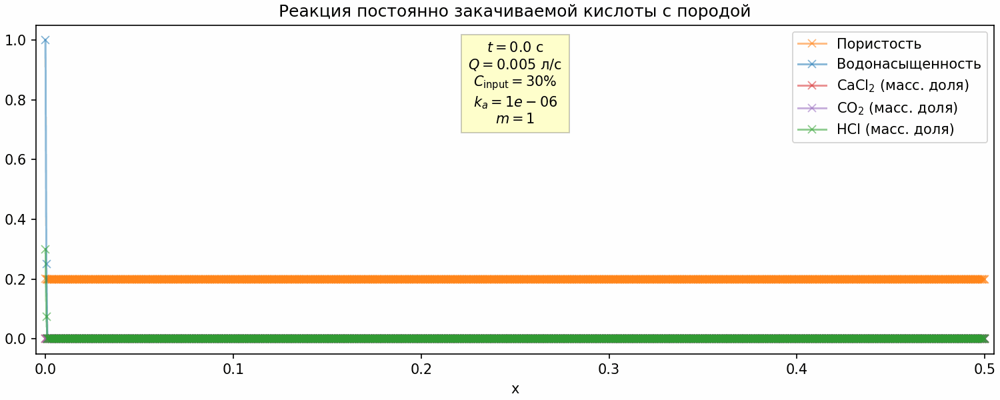

# Моделирование различных процессов одномерной фильтрации

## Открыть в Google Colab

[](https://colab.research.google.com/github/lnrsmglln/1D_filtration)

## Результаты

<!--  -->



## Загрузка и подготовка локальной копии

```bash
$ git clone https://github.com/lnrSmglln/1D_filtration.git
$ pip install -r requirements.txt
```
